# Microsoftプログラミング技術全国ハンズオン UWP編 資料

## 1.注意事項
このハンズオンを行うには以下の環境が必要になります。  
* Windwos 10 搭載の PC
* Visual Studio Community 2015(もしくはそれ以上のエディション)
* ユニバーサル Windows アプリ開発ツール

準備ができていない方はお近くのスタッフに声をかけてください。

## 2.ファイル構成
UWP編のフォルダーには以下のものが含まれています。
* **README.md** : この資料
* **20170122HandsOnTokyo.sln** : 最終的な完成品のソリューションファイル
* **UWPHelloWorld/** : 課題 ボタン・テキストブロック・ダイアログのサンプル
* **UWPGithubReposOnLabel/** : 発展課題1 Githubのリポジトリー一覧を **テキストブロック** に表示するサンプル
* **UWPGithubReposOnList/** : 発展課題2 Githubのリポジトリー一覧を **リスト** に表示するサンプル

# 課題 ボタン・テキストブロック・ダイアログ
## 1.まずはプロジェクトを作ってみよう
インストールされたVisual Studioを起動します。  
起動したら以下の画面が立ち上がります。  
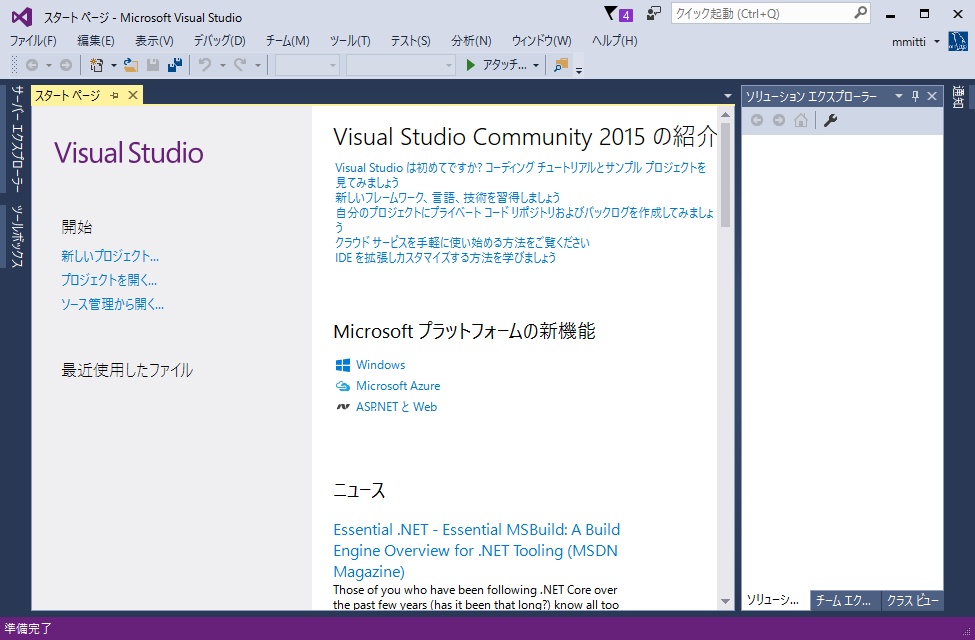  

続けてメニューの「ファイル(F)」から「新規作成(N)」を選択し、「プロジェクト(P)」を選択します。

プロジェクトのテンプレートを選択するダイアログが表示されます。  
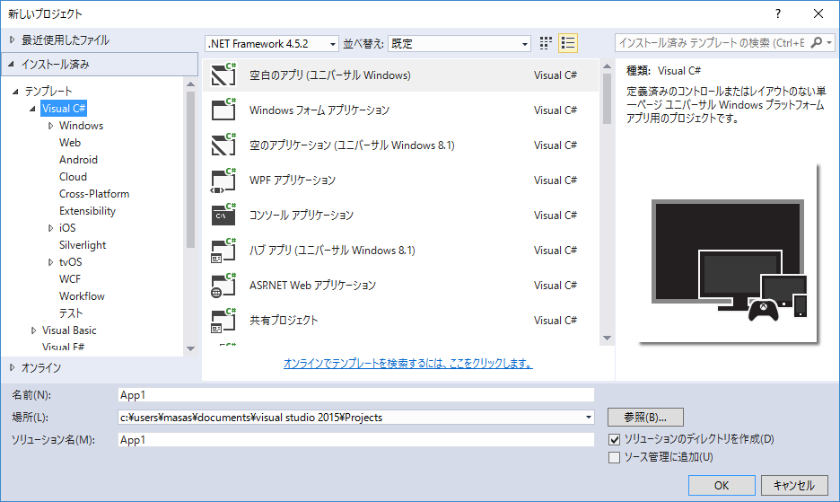  

左側のテンプレートから「Visual C#」を選択し「空白のアプリ（ユニバーサル Windows)」を選択します。  

また、名前及び保存場所を選択します。

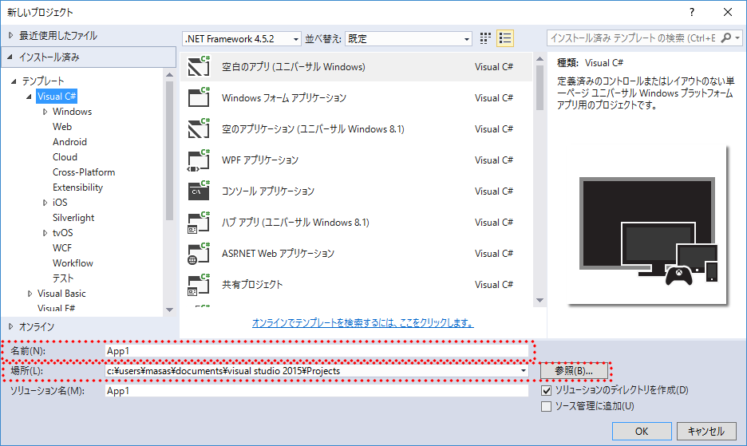  

名前は任意ですが、ここではUWPHelloとします。

内容を確認し、問題なければ「OK」ボタンを押します。

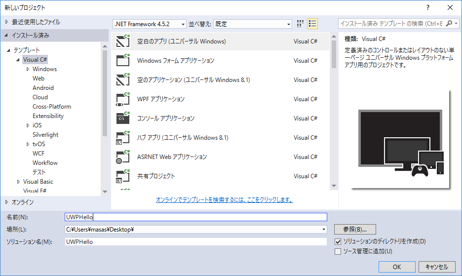  

Windows10のどのバージョン向けにプロジェクトを作成するか聞かれるのでデフォルトのまま「OK」を押します。

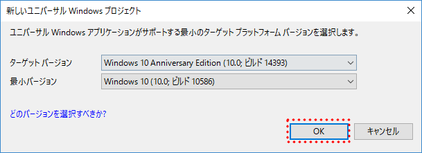  

初めてUWPを開発される方はWindowsの設定が開く場合があります。

この場合は「開発者モード」を選択してください。

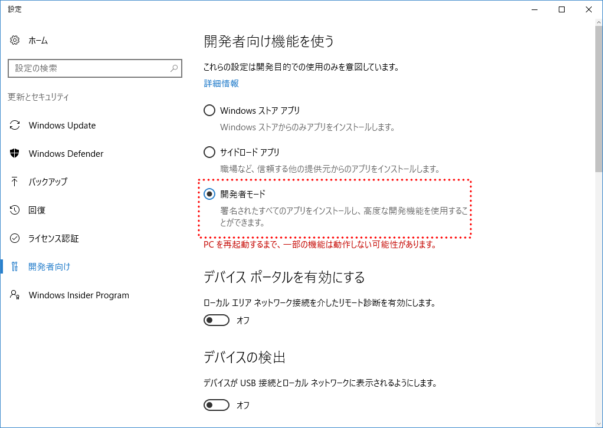  

暫く待つとプロジェクトが作成され、コードが表示されると思います。

  

正しく生成できたか確認するため一旦実行します。

ツールバー上の実行ボタン「ローカルコンピュータ」をクリックし実行します。

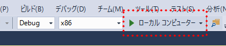  

実行ボタンの文字がローカルコンピュータ以外の場合は実行ボタン横「下三角マーク」を選択し「ローカルコンピュータ」を選択します。

ビルドが終わるのを待って白紙のUWPアプリが起動すれば問題ありません。

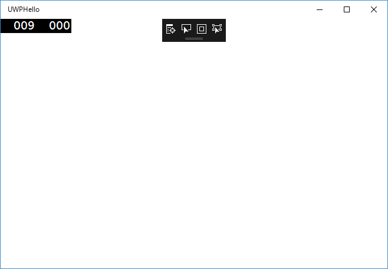  

## 2.画面をデザインしよう
UWPの開発において、今回はC#とXAMLという2つの言語を使います。  
XAMLはマークアップ言語でユーザーインターフェースを定義するために用います。    
また、XAMLに対応するC#コードでイベントの処理やロジックを記載します。  

新規作成したプロジェクトには2つのXAMLが入っています。

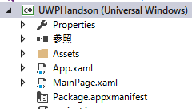  

今回は最初に表示される画面に対応するMainPage.xamlを編集します。  

(App.xamlはアプリ全体で利用されるリソースなどを定義するのに利用します。)  

「ソリューションエクスプローラー」から「MainPage.xaml」をダブルクリックして開きます。

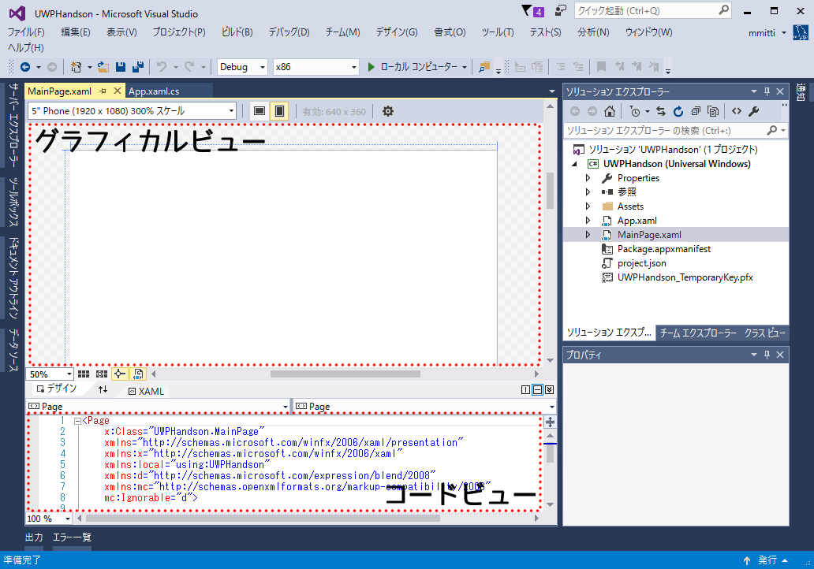  

するとXamlエディタが表示されます。

上部にグラフィカルビュー、下部にXAMLのコード（コードビュー）が表示されます。

また左側の「ツールボックス」には利用できるUIパーツ（ボタンや文字を表示するテキストブロック、文字を入力するテキストボックスなど）が表示されています。

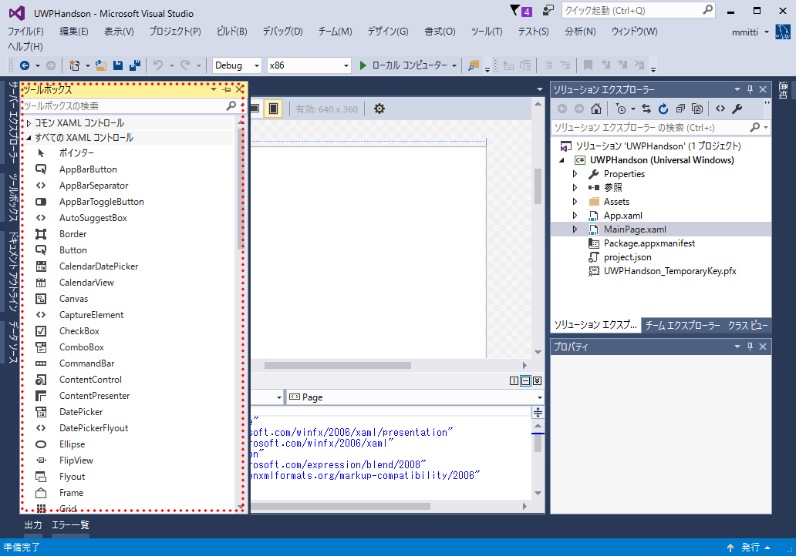 

### 2.1 ボタンを追加してみよう
UIの設計にはXAMLのコードを直接記述する方法とグラフィカルビューを利用する2つの方法があります。  
まずはグラフィカルビューを利用してボタンを追加します。

「ツールボックス」から「Button」をさがし「Button」をドラッグしてグラフィカルビューの白いページ部分にドロップします（左上がおすすめです）  

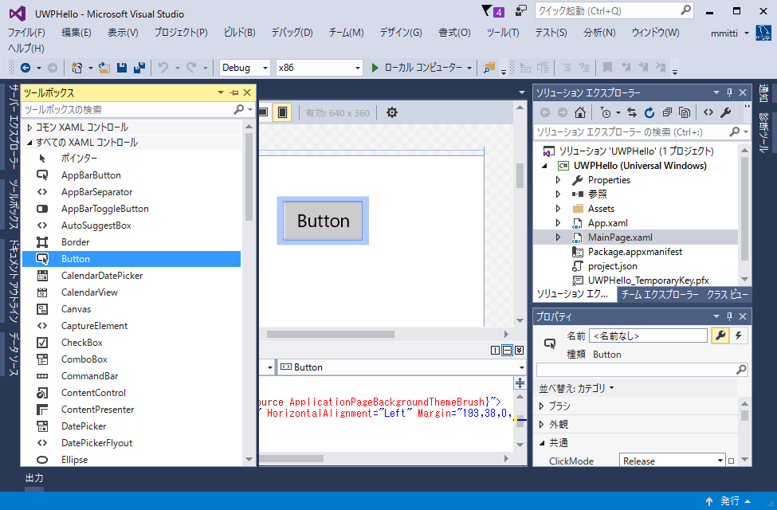 

場所を変更したい場合はグラフィカルビュー上のボタンをドラッグすることで変更できます。

この状態で実行するとボタンが表示されます。

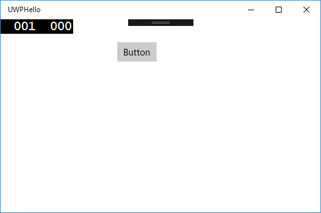  

### 2.2 ボタンに表示されている文字を変えてみよう
追加したUIパーツはサイズや場所、背景の色や文字の大きさなど様々なパラメーターを設定できます。  
ここでは先程追加したボタンに表示されている文字列をグラフィカルビューを使って変更してみます。

まず、先程追加したグラフィカルビュー上のボタンをクリックして選択します。

次に「プロパティー」ウィンドウを開きます。(最初から表示されている場合もあります)

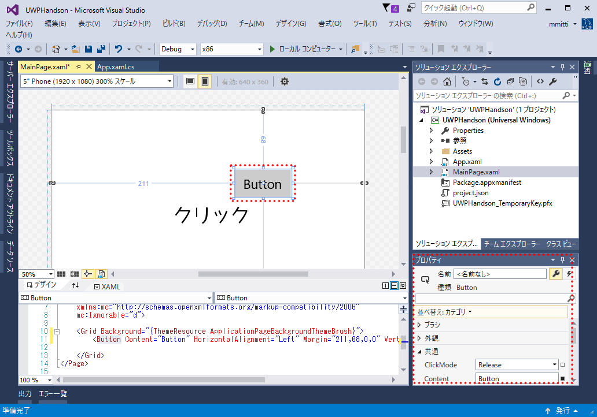  

ボタンに関するパラメーターがたくさん表示されています。  

今回は表示されている文字を変えるので「共通」の中の「Content」を編集します。  

デフォルトでは「Button」になっていますので例えば「Click Here」にしてみます。  

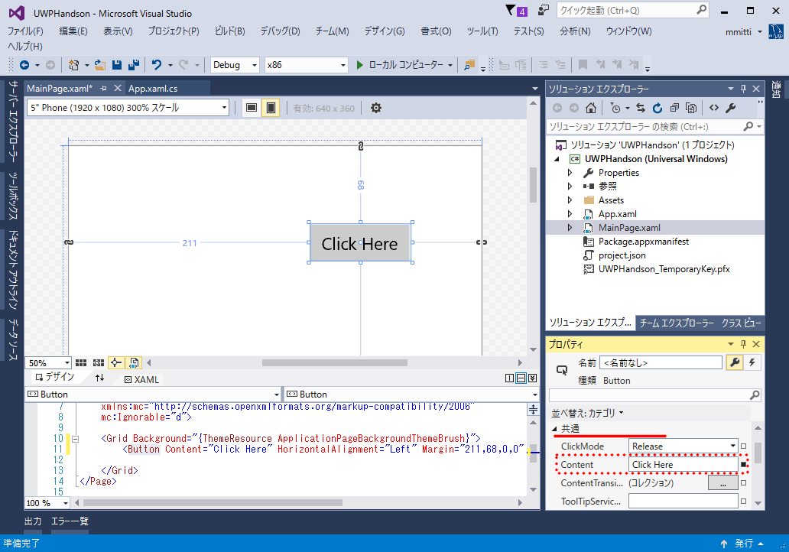  

変更後実行するとボタンの文字が変わっていると思います。  

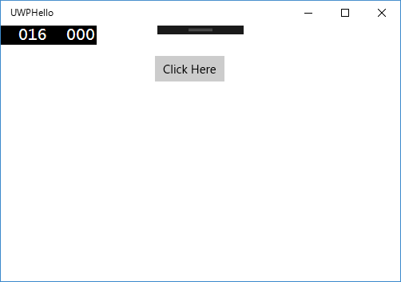  

>### メモ  
>主要なパラメーターとして背景色などの色は「ブラシ」、座標や余白などに関しては「レイアウト」、表示されている文字の大きさやフォントに関しては「テキスト」にパラメーターがあります。  
>パラメーターの数はたくさんあるため全部覚える必要はなく、必要なときに調べて使えればいいと思います。  
>
>例えばボタンの場所を変えるには「レイアウト」のMarginを変更します。  
>左100 上100にすると図のようになります。  
>  

### 2.3 テキストブロックを追加しよう
今度は文字を表示するテキストブロックを追加します。  
先程のボタンと異なりXAMLのコードを直接編集して追加します。

コードビューのコードを見ると以下のようになっていると思います。

``` xaml
<Page
    x:Class="App1.MainPage"
    xmlns="http://schemas.microsoft.com/winfx/2006/xaml/presentation"
    xmlns:x="http://schemas.microsoft.com/winfx/2006/xaml"
    xmlns:local="using:App1"
    xmlns:d="http://schemas.microsoft.com/expression/blend/2008"
    xmlns:mc="http://schemas.openxmlformats.org/markup-compatibility/2006"
    mc:Ignorable="d">

    <Grid Background="{ThemeResource ApplicationPageBackgroundThemeBrush}">
        <Button Content="Click Here" HorizontalAlignment="Left" Margin="100,100,0,0" VerticalAlignment="Top"/>
    </Grid>
</Page>
```

重要なのは<Grid ...>から< /Grid>の間で、ここにUIのデザインをXAMLで記述します。

すでにグラフィカルビューで追加したボタンに関するXAMLが追加されています。  

この1行下にTextBlockを追加します。  
(TextBlockの位置がわかるようにテストと言う文字を表示します)
```xaml  
<Grid Background="{ThemeResource ApplicationPageBackgroundThemeBrush}">
    <TextBlock>テスト</TextBlock>
    <Button Content="Click Here" HorizontalAlignment="Left" Margin="100,100,0,0" VerticalAlignment="Top"/>
</Grid>
```

するとグラフィカルビューが更新されテキストブロックが追加されたのがわかると思います。

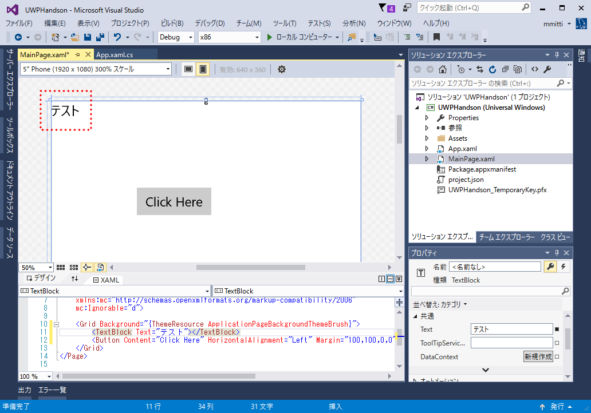  

### 2.4 テキストブロックの文字色と場所を変えてみよう
ボタンの時と同様にグラフィカルビューで要素を選択してプロパティーから変更することも可能ですが、ここではXAMLを直接編集して変更してみます。

文字色の変更ですがForegroundプロパティーを指定することで変更できます。

赤色にするなら以下のようにTextBlockのXAMLを変更します。  

```xaml
<TextBlock Foreground="Red">テスト</TextBlock>
```

もし、Visual Studioで手で入力されている方はForegくらいまで入力すると自動補完が効いて選択肢が1つになると思うのでそのままEnterキーを押すことで入力できます。    
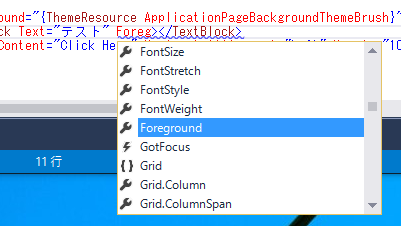   
また、指定する色も指定できる色の一覧が候補として表示されると思います。  
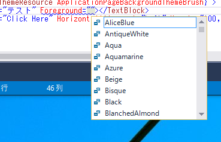  

色を指定すると即グラフィカルビューが更新されます。  
また、プロパティーウィンドウの「ブラシ」を確認するとそちらも更新されていることに気づくかと思います。

  

場所の変更はMerginプロパティーを指定することで変更できます。

例えばページの左から20、上から100の位置に移動させたいときは

```xaml
　<TextBlock Foreground="Red" Margin="20, 40, 0, 0">テスト</TextBlock>
```

のように編集します。

ここまで行うい実行すると以下のようになります。  
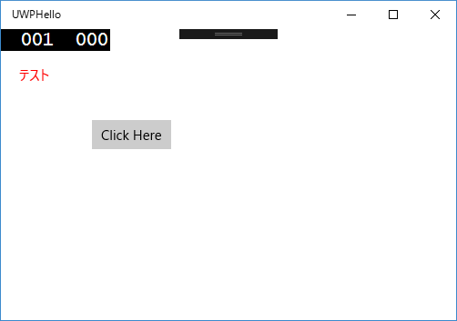  

>## メモ
>XAMLに記述する要素の順番には意味があります。  
>例えば先程のサンプルのTextBlockとButtonの順番を入れ替えてみます。  
>```cs
><Grid Background="{ThemeResource ApplicationPageBackgroundThemeBrush}">
>   <Button Content="Click Here" HorizontalAlignment="Left" Margin="100,100,0,0" VerticalAlignment="Top"/>
>   <TextBlock Foreground="Red" Margin="20, 40, 0, 0">テスト</TextBlock>
></Grid>
>```
>この状態で実行してボタンをクリックするとクリックできません。  
>これはボタンの手前にテキストブロックが表示されているためです。  
>基本的には下の要素ほど手前に来ますが、要素の前後関係を制御するにはZIndexプロパティーを指定することで制御できます。


## 3.ボタンを押したときに処理をしよう
先程追加したボタンはそのままでは何も起きません。  
UIパーツはそれぞれが例えば押された、マウスが乗った、キーが押されたなどの**イベント**が起きたときに処理を追加してあげることで初めて動きます。  

今回はボタンを押されたときにメッセージボックスが表示され、テキストブロックの文字が変わると言うものを作ります。  

### 3.1 UIパーツに名前をつける
イベントの処理を行うためにC#のコードを書きますが、C#のコードでUIパーツを識別するためにXAMLで名前をつけます。

名前の指定はXAMLの各要素に x:Name="名前" を属性として追加します。  
先程追加したボタンにはButton、テキストブロックにはLabelという名前を追加します。  

```xaml  
<Grid Background="{ThemeResource ApplicationPageBackgroundThemeBrush}">
    <TextBlock x:Name="Label" Foreground="Red" Margin="20, 40, 0, 0">テスト</TextBlock>
    <Button x:Name="Button" Content="Click Here" HorizontalAlignment="Left" Margin="100,100,0,0" VerticalAlignment="Top"/>
</Grid>
```

### 3.2 イベントハンドラーの追加
ボタンが押された、マウスが乗ったなどのイベントが起きたときに行う処理（イベントハンドラー）を追加します。  
まず、現在編集しているMainPage.xamlに関連付けられたC#のコード MainPage.xaml.csを開きます。  

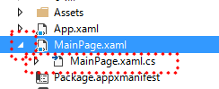

開くとthis.InitializeComponent();を呼び出しているだけのコンストラクターがあります。  
InitializeComponent()はXAMLから自動生成されたコードの中で定義されています。  

次にボタンを押されたときに処理するメソッドを作成します。  

戻り値や引数の型は決められたものにする必要がありますが、メソッド名は自由に決めても大丈夫です。  
ここではbutton_Clickとします。  

```cs
private async void button_Click(object sender, RoutedEventArgs e)
{
    /*あとで追加*/
}
```

続けてボタンが押されたというイベントと作成したメソッドを対応付けます。  

コンストラクターを以下のように変更します。  

```cs
public MainPage()
{
    this.InitializeComponent();
    this.Button.Click += button_Click;
}
```

これは先程**Button**と名付けたボタンの**クリックイベント**が起きたときに**button_Click**というメソッドを呼び出すように登録する...という処理になります。  

### 3.3 ダイアログを出してみる
このままではメソッドが呼び出されても何もしないので試しにダイアログを出してみます。  

UWPのダイアログはいくつか種類がありますが、ここでは簡単に使えるMessageDialogを使います。


```cs
private async void button_Click(object sender, RoutedEventArgs e)
{
    var dialog = new MessageDialog("Hello UWP world!", "hello world");
    await dialog.ShowAsync();
}
```

MessageDialogのインスタンスを作成しdialogという変数に格納します。  
その後MessageDialogのShowAsync()を呼び出すことでダイアログが表示されます。  
ShowAsyncは非同期なメソッドなのでawaitをつけてダイアログを閉じるまで待ちます。  

上記のコードを追加してもnew MessageDialog付近に赤下線がでてきます。

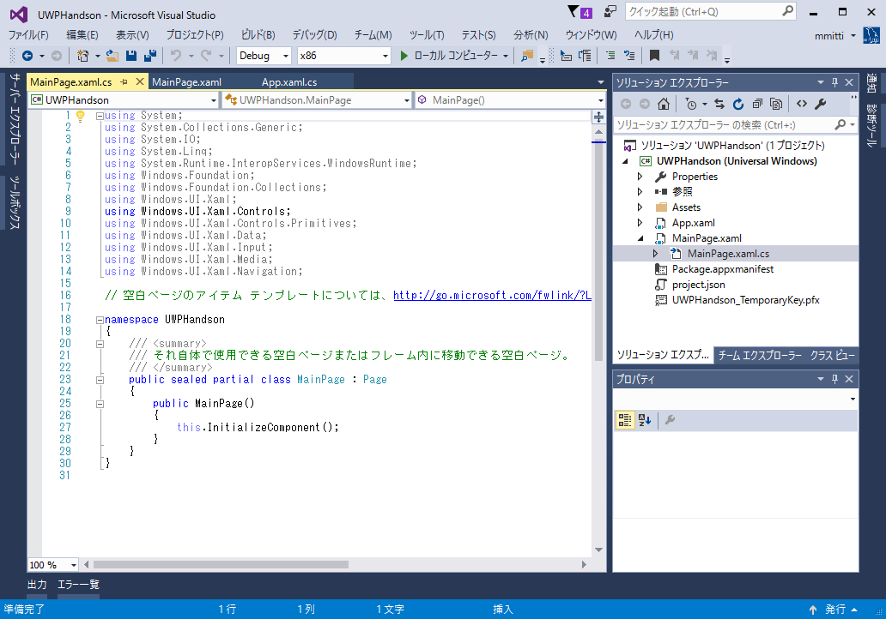  

下線の上にマウスカーソルを持っていくとヒントボタンが出てくるのでusing Windows.UI.Popups;を選択します。  

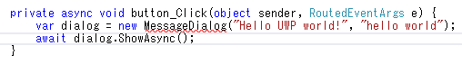  
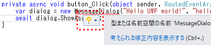  

これはC言語のincludeに相当するものです。  

この段階で実行しボタンを押してみると図のようにダイアログが表示されます。  
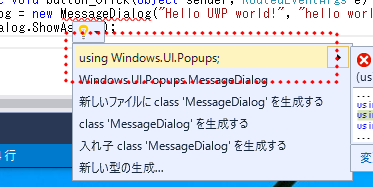  

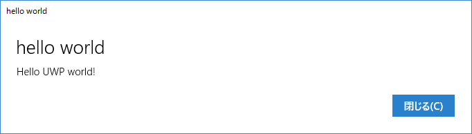

### 3.4 テキストブロックやボタンのプロパティを変更する
先程に引き続きボタンが押されたときにテキストブロックやボタンのプロパティを変更してみます。  
ボタンの文字列を変更するにはButtonのContentプロパティーを変更します。  

```cs
private async void button_Click(object sender, RoutedEventArgs e)
{
    var dialog = new MessageDialog("Hello UWP world!", "hello world");
    await dialog.ShowAsync();
    this.Button.Content = "Hello UWP World";
}
```
お気づきかもしれませんが、XAMLで設定したプロパティーの名前とコードで指定するプロパティー名は対応しています。

同様にテキストブロックのプロパティーも変更してみます。  
いろいろなプロパティがありますが文字の大きさ(FontSize)とテキスト(Text)を変えてみます。  

```cs
private async void button_Click(object sender, RoutedEventArgs e)
{
    var dialog = new MessageDialog("Hello UWP world!", "hello world");
    await dialog.ShowAsync();
    this.Button.Content = "Hello UWP World";
    this.Label.FontSize = 30;
    this.Label.Text = "You're Completed first step!";
}
```

この状態で実行しボタンを押すと、ダイアログが表示され、ダイアログを閉じるとテキストブロックのサイズと文字、ボタンの文字が変化します。  

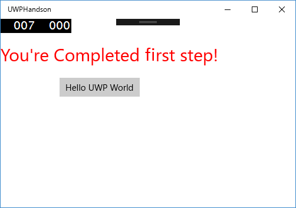

# お疲れ様でした
これにて午前の部 UWP編は終わりです。  

時間がある方、難易度が低いと感じた方は引き続き発展課題にも挑戦してみてください。
また、帰宅後に興味を持ったという方はぜひ発展課題に挑戦してみてください。  

なお、発展課題の内容は午後に行うXamarin編と同等の内容をUWPで行うものになります。  

# 発展課題1 Githubのリポジトリー一覧をテキストブロックに表示するサンプル