# Microsoftプログラミング技術全国ハンズオン Xamarin編 資料

## 1.注意事項
このハンズオンを行うには以下の環境が必要になります。

・Windows10搭載のPC(Macの方はOSを最新の状態に)

・Windowsの方はVisual Studio Community 2015(もしくはそれ以上のエディション)Macの方はxamarinstudio

・xamarinFormsアプリ開発ツール

準備ができていない方はお近くのスタッフに声をかけてください。

## 2. ファイル構成
xamarin編のフォルダーには以下のものが含まれます。


# 課題1 ボタンを押して文字を変えてみよう！

## 1.まずはプロジェクトを作ってみようxamarin編
インストールされたVisual Studioを起動します。起動したら以下の画面が立ち上がります


続けてメニューの「ファイル(F)」から「新規作成(N)」を選択し、「プロジェクト(P)」を選択します。

プロジェクトのテンプレートを選択するダイアログが表示されます。
今回はVisualC#内のCloss-Platform内のBlank Xaml App(Xamarin.FormsShared)
を選択しOKを押しましょう名前はなんでもかまいません。


作成時間に時間がかかるので少々お待ちください。

作成時にこのような画面が出るかと思いますがskipしてください


Windows10のどのバージョン向けにプロジェクトを作成するか聞かれるのでデフォルトのまま「OK」を押します。


時間がたてばこのような画面が表示されると思います。


このような画面が作成されればプロジェクトの作成は成功です。

作成が成功したらNuGetの更新をしましょう
プロジェクト名.UWPを右クリックしてNuGet パッケージの管理を選択しましょう


ここでおそらく更新プログラムにXamarin.Formsがあると思いますので選択して更新しましょう！


正しく生成、更新できたか確認するために一旦ビルドしましょう。

画像のようにビルドの設定を変えましょう


変更できたらローカルコンピューターの左にある矢印を押して実行しましょう

このような実行結果が得られたらひとまず成功です。


>## Macの方へandroidでのビルド
>
>Macの方はxamarinstudioで進めているため、Xamarin.UWPファイルが存在せず、
>ローカルPCでの起動ができないためandroidで起動しましょう
>
>xamarinstudioでのXamarinForms作成方法は以下の通りになります。
>
>まずはxamarinstudioを起動してください
>
>そして下記画像のように
>
>新しいソリューション => Multiplatform => Forms Appを選択してください
>
>
>作成ができたら以下のような画像のようなファイル構成でソリューションが作られます
>
>
>作成できましたら以下の画像のように左上の部分を変更してください
>Xamarin.Droid > Debug > Androidエミュレーター or 実機
>
>上記画像のようにビルド成功してエミュレータが起動できれば成功です。（上記画像はPCのメモリが足りずアプリの画面まではいけてないのですがビルドは成功しています）
>
>後はWindowsと同じファイルを編集していくことになりますので引き続き作業を進めてください。

>## Windowsの方へ、UWPでのビルドがうまくいかない場合
>Windowsの方で実行ボタンを押すと図のようにエラーが出る場合があります。  
>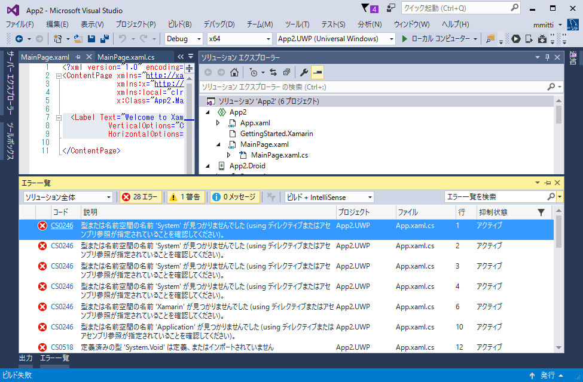  
>この場合はパッケージの更新を行うと解消できる場合があります。  
>
>まずUWPのプロジェクトを右クリックし「Nugetパッケージの管理(N)」を選択します。  
>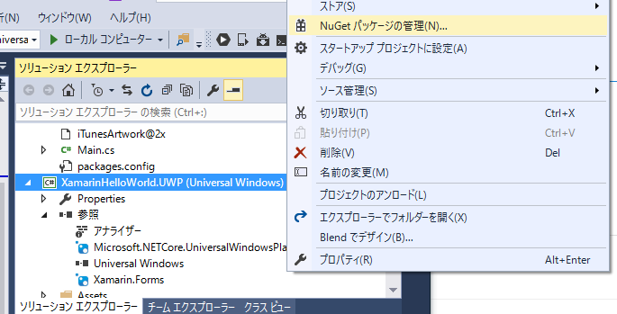  
>
>パッケージマネージャー上で「更新プログラム」タブを選択し、「Microsoft.NetCore....」を選択し、「更新」を選択します。  
>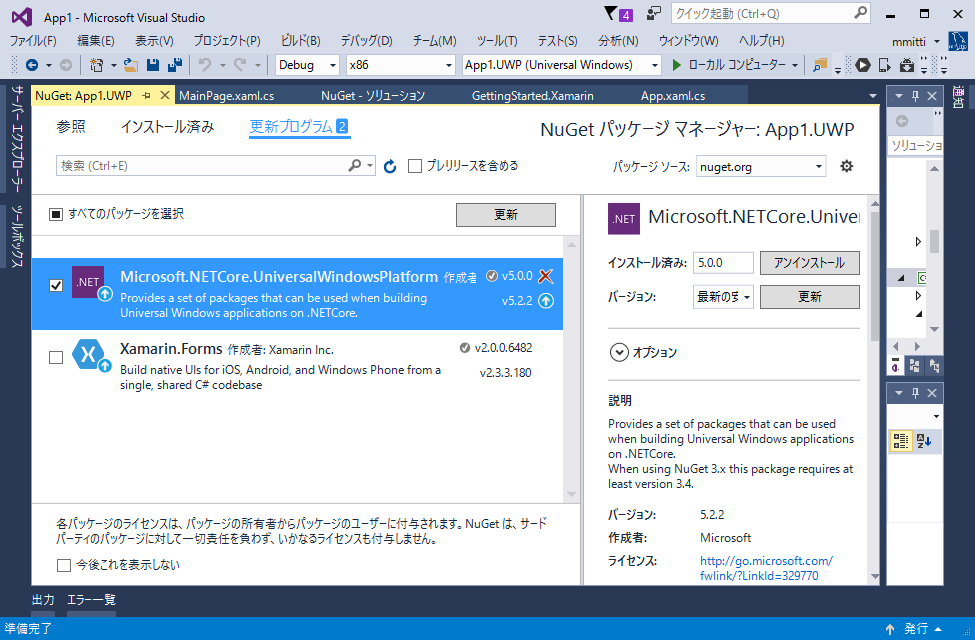  
>幾つか確認のダイアログが出ますが「OK」を押してください。  
>しばらくまって出力に正常にインストールされましたと表示されれば更新完了です。  
>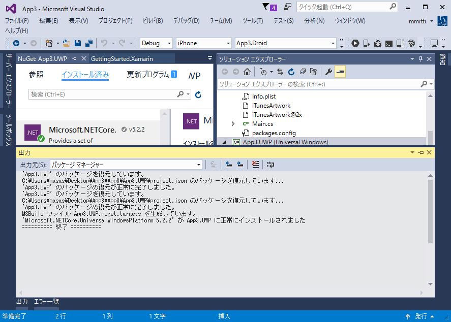   
>
>続けてXamarin.formsのパッケージを入れ直します。  
>同じくパッケージマネージャーから「Xamarin.Forms」を選択し「アンインストール」を選択します。  
>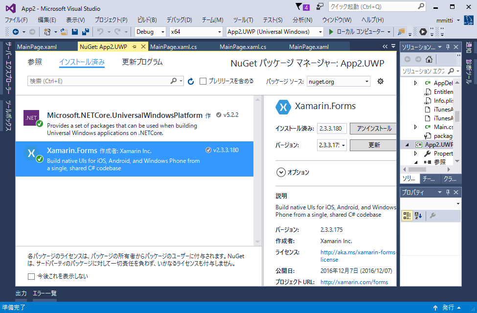   
>出力に**正常にアンインストールされました**と表示されたら再度パッケージマネージャーを開き、「参照」を選択、検索ボックスに「Xamarin.Forms」と入力しXamarin.Formsを選択、「インストール」ボタンを押します。
>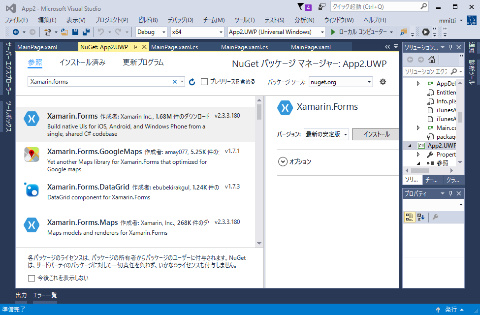   
>しばらくまって出力に正常にインストールされましたと表示されれば完了です。 

## 2.画面をデザインしよう

xamarinの開発においても今回はC#とXAMLという2つの言語を使います。

今回編集する箇所は以下の画像のMainPage.xaml内になります。

「ソリューションエクスプローラー」から「自身の作成したプロジェクト名(画像ではsamplexamarin)」内の「MainPage.xaml」をダブルクリックして開きます。


するとXamlエディタが表示されます。


UWPと違ってXamarinの方はグラフィカルビューがありませんのでご注意ください。

なのでコードを直接記述してレイアウトの編集を行っていきます。


### 2.1 初期に作られたコードを理解しよう！

まずはMainPage.xamlのコードを見てみましょう


ここの7行目~10行目にある

```cs

<Label Text="Welcome to Xamarin Forms!"
         VerticalOptions="Center"
         HorizontalOptions="Center" />

```

このコードによって先ほど実行した画面のWelcome to Xamarin Forms!が表示されています。

この中の

```cs

<Label Text="Welcome to Xamarin Forms!"

```

を

```cs

<Label Text="Hello World!"

```

と変えることで実行画面が以下のようにかわるます

初めに実行したようにローカルコンピューターの右側の三角形を押します。他の設定は変えないでください。


このように変更されたことがわかります。

ここから色々と変えていきましょう

文字の色を変えてみよう！

MainPage.xaml.cs内のLabel x:Name内に

```cs

 TextColor="Blue" FontSize="Medium"

```

を追加してみましょう

TextColorで文字の色を変更でき、FontSizeで文字の大きさを変更できます。自身で好きな値に変更してもらっても大丈夫です。

追加した結果のコードは以下のようになります

```cs

<?xml version="1.0" encoding="utf-8" ?>
<ContentPage xmlns="http://xamarin.com/schemas/2014/forms"
             xmlns:x="http://schemas.microsoft.com/winfx/2009/xaml"
             xmlns:local="clr-namespace:helloxamarin"
             x:Class="helloxamarin.MainPage"
             Title="Hello world">
<StackLayout>

  <Button x:Name="button" Text="Button" VerticalOptions="Center" HorizontalOptions="Center" />
  <Label x:Name="labelHelloWorld" Text="Change??"  TextColor="Blue" FontSize="Medium"
         VerticalOptions="Center"        
         HorizontalOptions="Center"/>
  </StackLayout>

</ContentPage>


```

これで起動してみましょう。


### 2.2 ボタンとラベルを配置してみよう！

MainPage.xaml内の

```cs

<?xml version="1.0" encoding="utf-8" ?>
<ContentPage xmlns="http://xamarin.com/schemas/2014/forms"
             xmlns:x="http://schemas.microsoft.com/winfx/2009/xaml"
             xmlns:local="clr-namespace:samplexamarin"
             x:Class="samplexamarin.MainPage">

	<Label Text="Hello World!"
           VerticalOptions="Center"
           HorizontalOptions="Center" />

</ContentPage>

```

を

```cs

<?xml version="1.0" encoding="utf-8" ?>
<ContentPage xmlns="http://xamarin.com/schemas/2014/forms"
             xmlns:x="http://schemas.microsoft.com/winfx/2009/xaml"
             xmlns:local="clr-namespace:helloxamarin"
             x:Class="helloxamarin.MainPage"
             Title="Hello world">
  <StackLayout>

    <Button x:Name="button" Text="Button" VerticalOptions="Center" HorizontalOptions="Center" />
    <Label x:Name="labelHelloWorld" Text="Change??"  VerticalOptions="Center" HorizontalOptions="Center"/>
  </StackLayout>

</ContentPage>

```

に変えましょう。x:Nameというものがありますがこれはx:Class属性というものでコードビハインドとXAMLファイルを紐づけるためのタグとなります。コードビハインドクラスは5行目の             x:Class="helloxamarin.MainPage"によってhelloxamarin.MainPageになることがわかります。

変更したことによって以下のような画像になります。


### 2.3 ボタンを押したときにラベルを変化させよう！

MainPage.xaml.csを編集していきます。
以下のように編集しましょう


上の画像はこのコードを追加したものです。

```cs
button.Clicked += (sender, e) =>
{
    this.labelHelloWorld.Text = "Hello World!";
};

```

上記の式はラムダ式と呼ばれるもので

```

(引数1, 引数2...) => 式

```

で定義されるものでプログラムの書き方のひとつになります。


コードの記入ができたら実行してみましょう


上の画像はクリックした結果になります。

クリックしてラベルの文字が変更されれば成功です。

何かエラーが発生した場合はメンターに質問してください。

# 発展課題1 Githubのリポジトリ一覧をラベルに表示する
昨今のアプリケーションではインターネットが当たり前となり、ネットからデータを取得したり、サーバとやり取りを行うことが少なくありません。
この課題ではその一例として「ボタン」を押すと、GithubのAPIと接続し「エントリ」で指定したユーザのリポジトリ一覧を「ラベル」に表示するものを作成します。


## 1. エントリの追加
基本課題にコンポーネントを追加していきます。
今回は文字入力を行う事ができるコンポーネントであるエントリ(Entry)を追加します。

MainPage.xamlに以下のようになるように編集します.

``` MainPage.xaml
<?xml version="1.0" encoding="utf-8" ?>
<ContentPage xmlns="http://xamarin.com/schemas/2014/forms"
             xmlns:x="http://schemas.microsoft.com/winfx/2009/xaml"
             xmlns:local="clr-namespace:helloxamarin"
             x:Class="helloxamarin.MainPage"
             Title="Hello world">
  <StackLayout>
    <Entry /> <!-- Added  -->
    <Button x:Name="button" Text="Button" VerticalOptions="Center" HorizontalOptions="Center" />
    <Label x:Name="labelHelloWorld" Text="Change??"  VerticalOptions="Center" HorizontalOptions="Center"/>
  </StackLayout>
</ContentPage>
```

さらにC#コード側から操作できるようにコンポーネントに名前をつけます.ここでは`Entry`という名前をつけることにします。

``` MainPage.xaml
<?xml version="1.0" encoding="utf-8" ?>
<ContentPage xmlns="http://xamarin.com/schemas/2014/forms"
             xmlns:x="http://schemas.microsoft.com/winfx/2009/xaml"
             xmlns:local="clr-namespace:helloxamarin"
             x:Class="helloxamarin.MainPage"
             Title="Hello world">
  <StackLayout>
    <Entry x:Name="Entry" /> <!-- Added  -->
    <Button x:Name="button" Text="Button" VerticalOptions="Center" HorizontalOptions="Center" />
    <Label x:Name="labelHelloWorld" Text="Change??"  VerticalOptions="Center" HorizontalOptions="Center"/>
  </StackLayout>
</ContentPage>
```

余裕があればプロパティを変更して自分好みのUIに仕上げましょう!

Androidの場合はこんな感じになるはずです。

図 Android Debug


## 2. エントリに入力された文字を取得する

続けてエントリに入力された文字列を取得します。
ここではここでは実際に取得できたことを確認するため、`ボタン`を押すと、`エントリ`に入力された文字が`ラベル`に表示される物を作ります。

ボタンのクリックイベントが起きた時に呼び出される`button_Click`メソッドの中身を変更します。

```MainPage.xaml

```


# 発展課題2 Githubから取得したリポジトリを一覧表示する  
先程までの手順でGithubのAPIを呼び出し、指定したユーザーのリポジトリ一覧を含むjsonを取得できました。  
ここの手順では取得したjsonからC#のオブジェクトに変換し、一覧表示をします。  

## 1.ライブラリの導入
取得したjsonをC#のオブジェクトに変換するため、Json.netというライブラリを導入します。  

Json.netを利用したjsonからC#のオブジェクトに変換する方法として複数の方法がありますが、ここではJson.netが提供するjsonのオブジェクトの配列を格納するJArrayとJsonのオブジェクトを示すJTokenに変換します。  

json.netについては[こちら](http://www.newtonsoft.com/json)を御覧ください。  

ライブラリの導入にはnugetというパッケージマネージャーを利用します。  

ソリューションを右クリックし「NuGetパッケージの管理(N)」を選択します。  
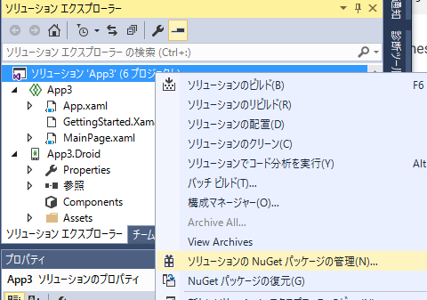  

次に「参照」を選択し検索ボックスに「Json.net」と入力します。  
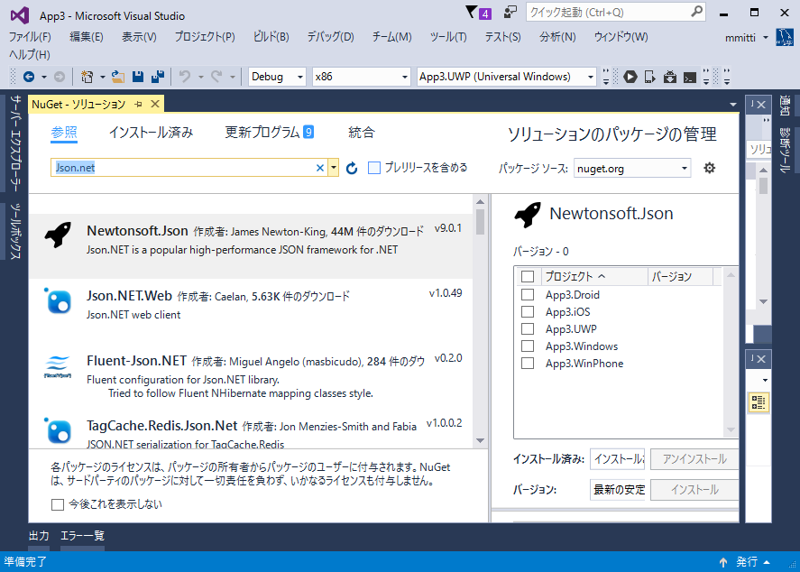  

「Newtonsoft.Json」を選択しすべてのプロジェクトにチェックを入れ「インストール」を選択します。  
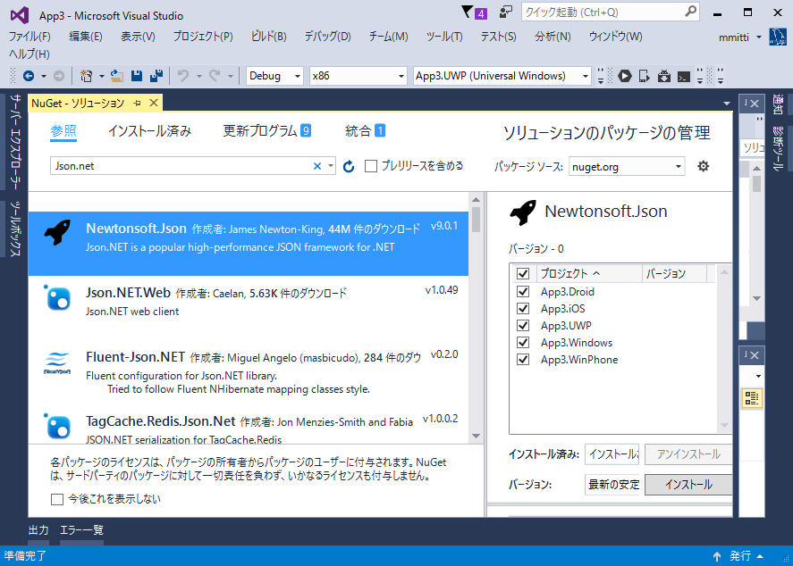  

インストールするプロジェクトの名前を確認して「OK」を選択します。  
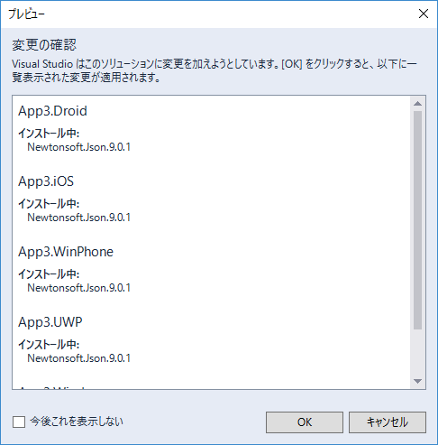  

出力に正常にインストールされましたと表示されれば完了です。  
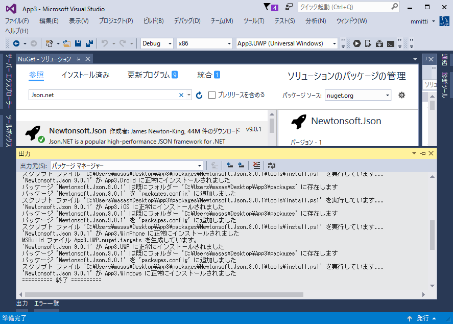  

## 2. 取得したjsonデータをC#のオブジェクトに変換
まずはGithubのリポジトリを取得するメソッドGetGithubReposを文字列のリストを返すためMainPage.xaml.csを開き以下のように定義を変更します。  
また、取得したjsonを格納する変数と返すリストの変数も用意します。  

```cs
public async Task<IList<string>> GetGithubRepos(string userName){
  var jsonRaw = "";
  var ret = new List<string>();
  try {
    *略*/
  }catch(Exception e){
    /*略*/
  }
  return ret;
}
```

続けて、HttpClient.GetStringAsyncを呼び出していた部分を以下のように取得しGetStringAsyncの結果をjsonRawに格納します。

```cs
public async Task<IList<string>> GetGithubRepos(string userName){
  /*略 using文の中*/
  jsonRaw = await httpClient.GetStringAsync(/*略*/);
  /*略*/
}
```

続けてjson文字列からJson.netのJArrayに変換します。  
これはGithubのjsonの形式がオブジェクトの配列という形式になっているからです。  

```cs
/*jsonRaw直後 usingの外*/
var array = JArray.Parse(jsonRaw);
```

最後にこの配列を順番に読み出します。   
JArrayはJTokenのコレクションなので以下のようにforeachを回します。  

また、JTokenにはGithubのAPIの応答の各オブジェクトの値が辞書のように入っているので添字に要素名を指定します。  

ここではリポジトリ名を取得するため"name"としています。  

Jtokenで取得できる値は型を指定する必要があるため.Value<string>()でstring型して取得します。  

```cs
foreach (JToken token in array)
{
    ret.Add(token["name"].Value<string>());
}                

```

これでGetGithubReposを呼び出すと指定したユーザーのリポジトリ名の一覧が格納されたリストが返却されるというメソッドが出来上がりました。  

## 3. リストに表示する
要素を一覧表示するリスト(ListView)を追加します。 

まずMainPage.xamlを開きLabelを削除してListViewを追加します。  

ここではListという名前をつけます。  

```xaml
<ListView
  x:Name="List" />
```

ListViewはItemsに要素を追加したり、Xaml上で子に要素を追加すると一列に並べて表示されます。  
また、ItemSourceに配列などを渡すと一覧表示してくれるので今回はItemSourceにstringのリストを渡します。  

MainPage.xaml.csに戻りLabelに関するコードを削除し以下のようにして取得したリストをList.ItemSourceにセットします。  

```cs
private async void Button_ClickedAsync(object sender, EventArgs e)
{
    /*略*/
    this.List.ItemsSource = result;
}
```

この状態でビルドし、実行し、テキストボックスに任意のユーザー名を入力してボタンを押すと図のようになります。　　
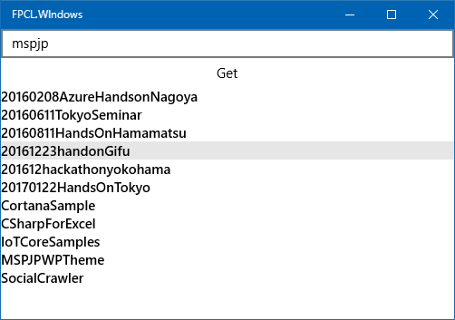  

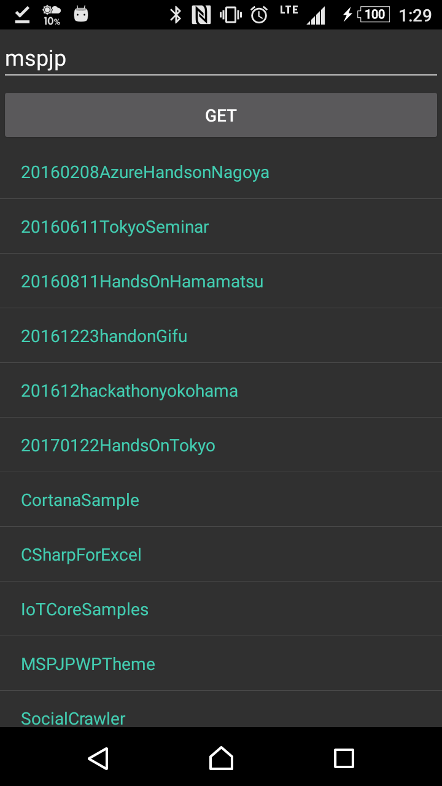  
